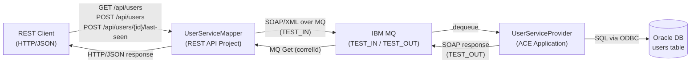

# UserService — ACE Demo Documentation

This folder contains the technical documentation for the **UserService** IBM App Connect Enterprise (ACE) demonstration project.

## Overview

The UserService demo implements a classic **REST-to-SOAP bridging** scenario: an HTTP/JSON REST API is exposed to consumers, and the ACE integration layer translates those calls to SOAP/XML messages transported over IBM MQ, forwarding them to a back-end service that reads from and writes to an Oracle database.

## Architecture at a Glance

## Project Structure

| Project | Type | Description |
|---------|------|-------------|
| [`ServiceInterface`](doc/ServiceInterface.md) | Shared Library | WSDL + XSD contract shared by all projects |
| [`UserServiceMapper`](doc/UserServiceMapper.md) | REST API Project | Exposes REST API; maps REST↔SOAP; communicates via MQ |
| [`UserServiceProvider`](doc/UserServiceProvider.md) | ACE Application | Consumes SOAP/XML from MQ; performs CRUD on Oracle DB |
| [`UserServicePolicies`](doc/UserServicePolicies.md) | Policy Project | Security profile (BasicAuth) for the integration server |
| [`container`](doc/container.md) | Docker / Infrastructure | Docker image with ACE + MQ, runtime configuration |
| [`database`](doc/database.md) | Oracle SQL | Schema definition for the `users` table |

## Interfaces

### REST (consumer-facing)
Base URL: `http://example.com/api`

| Method | Path | Description |
|--------|------|-------------|
| `POST` | `/users` | Create a new user |
| `GET` | `/users` | Query users by id, name, and/or role |
| `POST` | `/users/{id}/last-seen` | Record a last-seen timestamp (fire-and-forget) |

Full OpenAPI definition: [`ace/UserServiceMapper/UserService.openapi.yaml`](ace/UserServiceMapper/UserService.openapi.yaml)

### SOAP (internal MQ transport)
WSDL: [`ace/ServiceInterface/UserService.wsdl`](ace/ServiceInterface/UserService.wsdl)  
Namespace: `http://example.com/userservice`

| Operation | Style |
|-----------|-------|
| `CreateUser` | Request-Reply |
| `GetUsers` | Request-Reply |
| `SetLastSeen` | One-way (fire-and-forget) |

## MQ Queues

| Queue | Purpose |
|-------|---------|
| `TEST_IN` | Inbound SOAP/XML requests → UserServiceProvider |
| `TEST_OUT` | Outbound SOAP/XML responses ← UserServiceProvider |
| `DLQ` | Dead-letter queue |
| `MONITORING_EVENTS` | ACE business events subscription |

## Related Files

- [SoapUI test suite](soapui/UserService-soapui-project.xml)
- [REST OpenAPI spec](api/UserService.openapi.yaml)
- [WSDL](api/UserService.wsdl)
