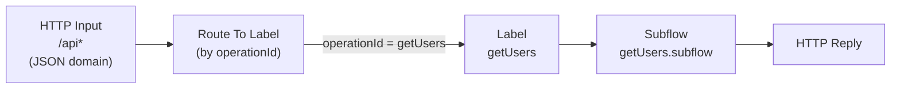

# UserServiceMapper — REST API Project

## Purpose

**UserServiceMapper** is an ACE *REST API Project* that acts as the **REST facade** for the UserService demo. It exposes a JSON/HTTP REST interface to consumers and bridges each REST call to a synchronous SOAP/XML message exchange over IBM MQ. The SOAP reply is received by correlation ID, mapped back to JSON, and returned as the HTTP response.

## Project Dependencies

```
UserServiceMapper
  └── ServiceInterface  (Shared Library — WSDL + XSD)
```

## Files

| File | Description |
|------|-------------|
| `UserService.openapi.yaml` | OpenAPI 3.0.3 definition — the REST interface contract |
| `restapi.descriptor` | ACE REST API descriptor — links OpenAPI to flow and subflows |
| `gen/UserServiceMapper.msgflow` | Auto-generated top-level flow (do not edit manually) |
| `getUsers.subflow` | Manually authored subflow — implements the `getUsers` operation |
| `getUsers_RequestMapping.map` | MSL mapping — REST/JSON → SOAP/XML request |
| `getUsers_ResponseMapping.map` | MSL mapping — SOAP/XML response → REST/JSON |
| `getUsers_SetCorrelId.esql` | ESQL — copies MQ message ID into MQMD CorrelId for correlation |

---

## REST API Contract

Base URL: `http://example.com/api`  
Full spec: [`UserService.openapi.yaml`](../ace/UserServiceMapper/UserService.openapi.yaml)

| Method | Path | Operation | Description |
|--------|------|-----------|-------------|
| `POST` | `/users` | `createUser` | Create a new user. Returns `201` with the generated `id`. |
| `GET` | `/users` | `getUsers` | Query users. Accepts optional `id`, `name`, `role` query params. |
| `POST` | `/users/{id}/last-seen` | `setLastSeen` | Fire-and-forget last-seen timestamp update. Returns `202`. |

> **Note:** Currently only `getUsers` has a subflow implementation wired in `restapi.descriptor`. The `createUser` and `setLastSeen` operations are defined in the OpenAPI contract and the descriptor is ready to extend.

---

## Top-Level Flow: `UserServiceMapper` (auto-generated)

> This flow is generated by the ACE Toolkit REST API feature from the `restapi.descriptor` and **must not be edited manually**.

### Integration Scenario

The top-level flow accepts every incoming HTTP request on path `/api*`, routes it to the label matching the OpenAPI `operationId`, delegates to the corresponding subflow, and sends back the HTTP reply.

### Flow Diagram



---

## Subflow: `getUsers`

### Integration Scenario

This subflow implements the full **synchronous REST-to-SOAP-over-MQ** request-reply bridge for the `getUsers` operation:

1. The REST query parameters are mapped to a SOAP `GetUsersRequest` XML body.
2. A SOAP envelope is added and the message is put to `TEST_IN` with a reply-to of `TEST_OUT`.
3. The message ID written by the MQ Output node is copied into the MQMD CorrelId.
4. An MQ Get node waits for a reply on `TEST_OUT` matching that CorrelId.
5. The SOAP envelope is stripped and the SOAP body mapped back to a JSON array.

### Flow Diagram



```mermaid
flowchart LR
    IN["Subflow Input"]

    ReqMap["MSL Mapping\nRequestMapping\n(JSON → SOAP body)"]
    SOAPEnv["SOAP Envelope\n(create envelope)"]
    MQOut["MQ Output\nTEST_IN\n(request=true, replyToQ=TEST_OUT)"]

    SetCorrel["Compute\nSetCorrelId\n(MQMD.CorrelId ← msgId)"]
    MQGet["MQ Get\nTEST_OUT\n(getWithCorrelID=true)"]
    MQHdr["MQ Header\n(delete header)"]

    SOAPEx["SOAP Extract\n(strip envelope)"]
    RespMap["MSL Mapping\nResponseMapping\n(SOAP body → JSON)"]

    OUT["Subflow Output"]

    IN --> ReqMap
    ReqMap --> SOAPEnv
    SOAPEnv --> MQOut
    MQOut --> SetCorrel
    SetCorrel --> MQGet
    MQGet --> MQHdr
    MQHdr --> SOAPEx
    SOAPEx --> RespMap
    RespMap --> OUT
```

### Node Reference

| Node | Type | Key Properties |
|------|------|----------------|
| Subflow Input | `FCMSource` | Entry point from the top-level flow |
| RequestMapping | `ComIbmMSLMapping` | MSL: `getUsers_RequestMapping` — maps query params → `GetUsersRequest` XML |
| SOAP Envelope | `ComIbmSOAPEnvelope` | `createEnvelope=true` — wraps body in SOAP 1.1 envelope |
| MQ Output | `ComIbmMQOutput` | Queue: `TEST_IN`, `request=true`, `replyToQ=TEST_OUT` |
| SetCorrelId | `ComIbmCompute` | ESQL: `getUsers_SetCorrelId.Main` — sets CorrelId for reply matching |
| MQ Get | `ComIbmMQGet` | Queue: `TEST_OUT`, Domain: `XMLNSC`, MessageSet: `{ServiceInterface}`, `getWithCorrelID=true` |
| MQ Header | `ComIbmMQHeader` | Deletes MQMD header before passing downstream |
| SOAP Extract | `ComIbmSOAPExtract` | Removes SOAP envelope, exposes body |
| ResponseMapping | `ComIbmMSLMapping` | MSL: `getUsers_ResponseMapping` — maps `GetUsersResponse` XML → JSON array |
| Subflow Output | `FCMSink` | Returns to top-level flow → HTTP Reply |

### ESQL: `getUsers_SetCorrelId`

After the MQ Output node puts the request message, the generated MQ message ID is available in `InputLocalEnvironment.WrittenDestination.MQ.DestinationData.msgId`. This Compute node copies it into `OutputRoot.MQMD.CorrelId` so that the downstream MQ Get node can retrieve the correct reply.

```esql
SET OutputRoot.MQMD.CorrelId =
    InputLocalEnvironment.WrittenDestination.MQ.DestinationData.msgId;
```

---

## Message Mappings

### `getUsers_RequestMapping`

Transforms the inbound REST representation (query parameters) into the SOAP `GetUsersRequest` XML element under namespace `http://example.com/userservice`.

**Input:** HTTP query parameters (`id`, `name`, `role` — all optional)  
**Output:** `GetUsersRequest` XML element

### `getUsers_ResponseMapping`

Transforms the SOAP `GetUsersResponse` XML (zero or more `<user>` elements) into a JSON array of User objects.

**Input:** `GetUsersResponse` XML element  
**Output:** JSON array with fields `id`, `name`, `role`, and optionally `lastSeen`
