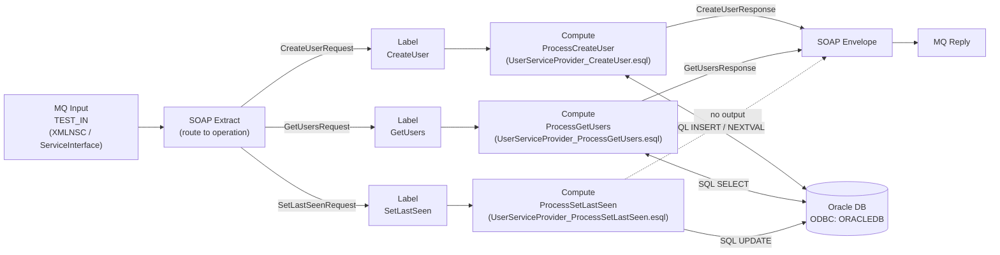

# UserServiceProvider — ACE Application

## Purpose

**UserServiceProvider** is an ACE *Application* that acts as the **back-end SOAP service** for the UserService demo. It reads SOAP/XML messages from an IBM MQ queue, routes them by operation, executes ESQL compute modules that query or update an Oracle database, wraps the result in a SOAP envelope, and writes the reply back to MQ.

## Project Dependencies

```
UserServiceProvider
  └── ServiceInterface  (Shared Library — WSDL + XSD)
```

## Files

| File | Description |
|------|-------------|
| `UserServiceProvider.msgflow` | Main message flow |
| `UserServiceProvider_CreateUser.esql` | ESQL compute — inserts a new user |
| `UserServiceProvider_ProcessGetUsers.esql` | ESQL compute — queries users with optional filters |
| `UserServiceProvider_ProcessSetLastSeen.esql` | ESQL compute — updates last-seen timestamp |
| `application.descriptor` | ACE application descriptor (declares ServiceInterface library ref) |
| `UnitTests/` | MQ-based unit test cases (4 tests) |

---

## Message Flow: `UserServiceProvider`

### Integration Scenario

The flow implements the **SOAP-over-MQ provider** pattern. An MQ input node dequeues the incoming SOAP message, the SOAP Extract node strips the envelope and routes by operation name, the appropriate Compute node runs the database logic, and the SOAP Envelope node re-wraps the result before the MQ Reply node sends it back to the reply-to queue.

### Flow Diagram



### Node Reference

| Node | Type | Key Properties |
|------|------|----------------|
| MQ Input | `ComIbmMQInput` | Queue: `TEST_IN`, Domain: `XMLNSC`, MessageSet: `{ServiceInterface}`, Schema validation: content+value |
| SOAP Extract | `ComIbmSOAPExtract` | `routeToOperation=true` — propagates to the label matching the root element name |
| CreateUser (Label) | `ComIbmLabel` | `labelName=CreateUserRequest` |
| GetUsers (Label) | `ComIbmLabel` | `labelName=GetUsersRequest` |
| SetLastSeen (Label) | `ComIbmLabel` | `labelName=SetLastSeenRequest` |
| ProcessCreateUser | `ComIbmCompute` | DataSource: `ORACLEDB`, ESQL: `UserServiceProvider_CreateUser.Main` |
| ProcessGetUsers | `ComIbmCompute` | DataSource: `ORACLEDB`, ESQL: `UserServiceProvider_ProcessGetUsers.Main` |
| ProcessSetLastSeen | `ComIbmCompute` | DataSource: `ORACLEDB`, ESQL: `UserServiceProvider_ProcessSetLastSeen.Main` |
| SOAP Envelope | `ComIbmSOAPEnvelope` | Wraps output in SOAP 1.1 envelope |
| MQ Reply | `ComIbmMQReply` | Sends response to the reply-to queue declared in the MQMD |

---

## ESQL Modules

### `UserServiceProvider_CreateUser`

**Purpose:** Inserts a new user record and returns the generated ID.

**Logic:**
1. Copies message headers to output.
2. Reads `name` and `role` from `InputRoot.XMLNSC.{ns}:CreateUserRequest`.
3. Fetches the next value from the Oracle sequence `users_id_seq` using `PASSTHRU('SELECT users_id_seq.NEXTVAL AS user_id FROM dual')`.
4. Executes `INSERT INTO Database.users (id, name, role)`.
5. Sets `OutputRoot.XMLNSC.{ns}:CreateUserResponse.id` to the generated ID.

**Database interaction:** `INSERT` + `NEXTVAL` sequence call.

---

### `UserServiceProvider_ProcessGetUsers`

**Purpose:** Queries the `users` table and returns matching records.

**Logic:**
1. Copies message headers to output.
2. Reads optional filter fields `id`, `name`, `role` from the request.
3. **Filter strategy:**
   - If `id` is provided → exact match: `SELECT * FROM USERS WHERE ID = reqId`
   - Else if `name` or `role` is provided → prefix LIKE: `SELECT * FROM USERS WHERE NAME LIKE ? AND ROLE LIKE ?` (empty string becomes `%`)
4. Builds `GetUsersResponse` with zero or more `<user>` child elements, each containing `id`, `name`, `role`, and optionally `lastSeen`.

**Database interaction:** `SELECT` with conditional WHERE clause.

---

### `UserServiceProvider_ProcessSetLastSeen`

**Purpose:** Updates the `last_seen` column for a given user ID.

**Logic:**
1. Reads `id` and `lastSeen` from `InputRoot.XMLNSC.{ns}:SetLastSeenRequest`.
2. Executes `UPDATE USERS SET LAST_SEEN = ? WHERE ID = ?`.
3. Returns `FALSE` — **no output message is generated**. This matches the one-way pattern of the WSDL operation.

**Database interaction:** `UPDATE`.

---

## Unit Tests

Tests are MQ-based and driven by properties files in `UnitTests/`. Each test puts a message on `TEST_IN` and expects a reply on `TEST_OUT`.

| Test | Input file | Operation | Description |
|------|-----------|-----------|-------------|
| test01 | `in01-01.msg` | `CreateUser` | Creates user `test user` with role `tester` |
| test02 | `in02-01.msg` | `GetUsers` | Queries by exact `id=8` |
| test03 | `in03-01.msg` | `GetUsers` | Queries by name prefix `tes` |
| test04 | `in04-01.msg` | `SetLastSeen` | Sets last-seen to `2026-09-22T16:17:16+01:00` for user `id=1` |

**MQ connection:** Queue manager `DEVQM`, channel `ADMIN_SVRCONN/TCP/localhost(1414)`.
