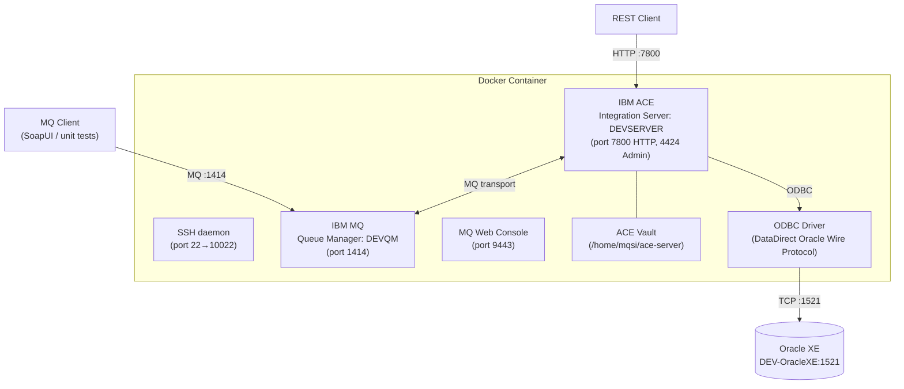

# Container — Docker / Deployment

## Purpose

The `container/ace-docker` folder provides a **self-contained Docker image** that bundles IBM ACE 13.0.6.0 and IBM MQ Advanced for Developers on Ubuntu 24.04. The image is intended for local development and demonstration; a single container runs both the MQ Queue Manager and the ACE Integration Server.

## Files

| File | Description |
|------|-------------|
| `Dockerfile` | Image build instructions |
| `entrypoint.sh` | Container startup script |
| `conf/server.conf.yaml` | ACE integration server overrides |
| `conf/defineQueues.mqsc` | MQ queue and channel definitions |
| `conf/mqconn.mqsc` | MQ security relaxation for development |
| `conf/odbc.ini` | ODBC data source configuration (Oracle) |
| `conf/odbcinst.ini` | ODBC driver manager configuration |
| `conf/mqwebuser.xml` | MQ Web Console user configuration |

---

## Architecture



---

## Build

```bash
podman build -t ace:13.0.6.0 --progress=plain -f Dockerfile . 2> build.log
```

### Build Arguments

| Argument | Default | Description |
|----------|---------|-------------|
| `HOST_IP` | `192.168.88.170` | IP of the local HTTP server serving the installer archives |
| `ACE_FILE_NAME` | `IBM_ACE_13.0.6.0_LNX_X8664_INCTK.tar.gz` | ACE installer archive filename |
| `ACE_URL` | `http://${HOST_IP}/${ACE_FILE_NAME}` | ACE installer download URL |
| `MQ_URL` | `http://${HOST_IP}/9.4.4.0-IBM-MQ-Advanced-for-Developers-UbuntuLinuxX64.tar.gz` | MQ installer download URL |
| `DB_STANZA` | `ORACLEDB` | ODBC data source name stored in vault |
| `DB_USER` | `xe` | Oracle database username stored in vault |
| `DB_PASS` | `pass123` | Oracle database password stored in vault |

> The build downloads MQ and ACE installer archives from an HTTP server on the local network. Adjust `HOST_IP` to match your environment.

---

## Run

```bash
podman run \
  --network acenet \
  --name DEV-ACE_13 \
  -p 7800:7800/tcp \
  -p 4424:4424/tcp \
  -p 1414:1414/tcp \
  -p 9443:9443/tcp \
  -p 12345:12345/tcp \
  -p 10022:22/tcp \
  -v mqsidata13:/home/mqsi \
  -v devnodedata13:/opt/DEVNODE \
  -v mqmdata13:/var/mqm \
  -dt localhost/ace:13.0.6.0
```

### Exposed Ports

| Port | Service | Protocol |
|------|---------|---------|
| `7800` | ACE HTTP listener | HTTP |
| `7843` | ACE HTTPS listener | HTTPS |
| `4424` | ACE Admin REST API | HTTP |
| `12345` | JVM debug port | JDWP |
| `1414` | MQ listener | MQ |
| `9157` | MQ metrics | HTTP |
| `9443` | MQ Web Console | HTTPS |
| `22` (→10022) | SSH | SSH |

### Persistent Volumes

| Volume | Mount point | Description |
|--------|-------------|-------------|
| `mqsidata13` | `/home/mqsi` | ACE work directory, vault, ODBC config |
| `devnodedata13` | `/opt/DEVNODE` | Integration server node data |
| `mqmdata13` | `/var/mqm` | MQ data directory |

---

## Startup Sequence (`entrypoint.sh`)

1. Source MQ and ACE environment profiles.
2. Start the SSH daemon (`sudo /usr/sbin/sshd`).
3. Start the MQ Queue Manager (`strmqm DEVQM`).
4. Apply MQ connectivity configuration (`mqconn.mqsc`).
5. Define MQ queues and channels (`defineQueues.mqsc`).
6. Start the MQ Web Console (`strmqweb`).
7. Start the ACE Integration Server:
   ```
   IntegrationServer
     --work-dir /home/mqsi/ace-server
     --admin-rest-api 4424
     --http-port-number 7800
     --mq-queue-manager-name DEVQM
     --name DEVSERVER
     --vault-key ${VAULT_KEY}
   ```

---

## MQ Configuration

### `mqconn.mqsc` — Security Relaxation

```mqsc
alter qmgr CONNAUTH('')        -- disable connection authentication
alter qmgr CHLAUTH(DISABLED)   -- disable channel authentication records
refresh security
alter qmgr CCSID(1208)         -- set UTF-8 character set
```

> These settings are appropriate for local development only. **Do not use in production.**

### `defineQueues.mqsc` — Queue and Channel Definitions

| Object | Type | Description |
|--------|------|-------------|
| `ADMIN_SVRCONN` | Server-connection channel | Used by tooling and unit test clients; MCA user: `mqsi` |
| `DLQ` | Local queue | Dead-letter queue (persistent, unlimited depth) |
| `TEST_IN` | Local queue | Inbound SOAP requests to UserServiceProvider |
| `TEST_OUT` | Local queue | Outbound SOAP responses from UserServiceProvider |
| `TEST_IN1` / `TEST_OUT1` | Local queues | Reserved for additional test cases |
| `MONITORING_EVENTS` | Local queue | Subscription destination for ACE monitoring events |

---

## ACE Server Configuration (`server.conf.yaml`)

```yaml
ResourceManagers:
  JVM:
    jvmDebugPort: 12345           # Remote debug port
    jvmSystemProperty: '-Dcom.ibm.xtq.processor.overrideSecureProcessing=true'
Monitoring:
  MessageFlow:
    publicationOn: active          # Publish message flow monitoring events
Events:
  BusinessEvents:
    File:
      enabled: true
      outputFormat: json
      filePath: /tmp/MonitoringEvents
      numberOfFiles: 200
      sizeOfFile: 100              # KB
    MQ:
      enabled: false
```

Monitoring events are written to JSON files under `/tmp/MonitoringEvents` inside the container. MQ-based event publication is disabled by default.

---

## ODBC Configuration

The Oracle database is accessed via the **DataDirect ODBC Oracle Wire Protocol** driver bundled with ACE.

| Setting | Value |
|---------|-------|
| DSN name | `ORACLEDB` |
| Driver | `/opt/ibm/ace-13.0.6.0/server/ODBC/drivers/lib/UKora95.so` |
| Host | `DEV-OracleXE` (container name on `acenet` network) |
| Port | `1521` |
| Service | `xe` |

Credentials for the DSN are stored in the ACE vault under the credential name `ORACLEDB` and injected at build time via `mqsicredentials`.

---

## Vault Credentials

Three credential entries are created during the Docker build:

| Type | Name | Username | Password | Purpose |
|------|------|----------|----------|---------|
| `odbc` | `ORACLEDB` | `xe` | `pass123` | Oracle DB access via ODBC |
| `local` | `UserServiceAuthAlias` | `test` | `test` | BasicAuth security policy |

> **Security note:** The vault key `passs1234` and all credential values are hardcoded in the Dockerfile and are for development purposes only. Rotate all secrets before any non-development deployment.
